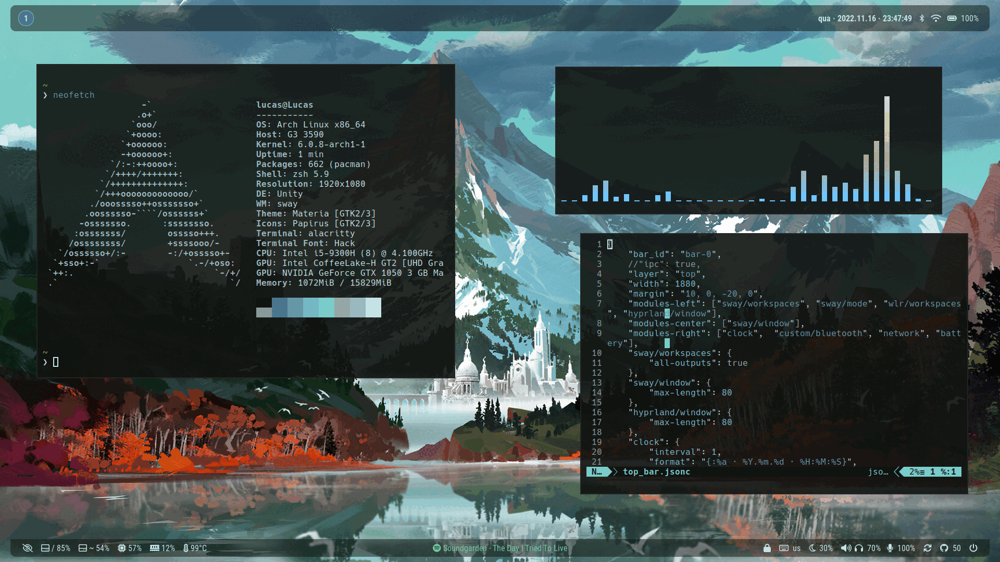
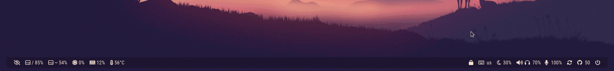

# serendipity



### An adaptable bar that looks nice in every setting


### A flexible bar that won't get in your way



## Custom modules

- GitHub notifications (from waybar repository)
- media with [playerctl](https://github.com/altdesktop/playerctl) (from waybar repository)
- wallpaper: change current wallpaper with [pywal](https://github.com/dylanaraps/pywal) (for a new colorscheme)
- lockbar: lock your bar via IPC on [Sway](https://github.com/swaywm/sway)
- power menu: opens a [wofi](https://hg.sr.ht/~scoopta/wofi) menu with systemd power options

## Dependencies

The only required dependencies are **waybar** and the fonts that are being used

- [waybar](https://github.com/Alexays/Waybar)
- [otf-font-awesome]()
- [roboto]()

If you want all the modules working, you'll also need to install optional dependencies

*__Note 1__: to use the workspaces module on Hyprland you need to either install the `waybar-hyprland-git` package from AUR or build Waybar from source following [these instructions](https://wiki.hyprland.org/Useful-Utilities/Status-Bars/#compiling-manually)*

*__Note 2__: the lockbar module only works on Sway, as it uses the `swaymsg` command*

## Optional dependencies

- [playerctl](https://github.com/altdesktop/playerctl): used in the media module
- [wofi](https://hg.sr.ht/~scoopta/wofi): used in the power menu module
- [jq](https://github.com/stedolan/jq): used in the media, GitHub, and lockbar modules
- [pywal](https://github.com/dylanaraps/pywal): used in the media, GitHub, and lockbar modules

## Setup

### Arch Linux

If you're on Arch, you can just run:

```
pacman -S waybar otf-font-awesome ttf-roboto
```

If you want to use all the modules, you can install the dependencies running:

```
pacman -S pywal wofi jq playerctl
```

Once you installed everything you need, clone this repository anywhere you want and place the `scripts` folder inside `~/.config/waybar`

You can do that running the following commands:

```
git clone https://github.com/lucasxavierleite/serendipity ~/.config/waybar/serendipity
mv ~/.config/waybar/serendipity/scripts ~/.config/waybar/scripts
```

Note that you can place these files anywhere you want, but you'll need to change the scripts folder path in the config files. For that, just replace `~/.config/waybar/scripts` with your scripts folder location

## Launch

To launch the full setup with both top and bottom bars, copy both `config` and `style.css` files to `~/.config/waybar` (or create a symlink) and simply run waybar.

To lauch the bars separetely, you can use the scripts `launch_top_bar.sh` and `launch_bottom_bar.sh`

```
nohup ~/.config/waybar/serendipity/launch_top.sh &> /dev/null &
nohup ~/.config/waybar/serendipity/launch_bottom.sh &> /dev/null &
```

Remember to check if you have the right permissions:

```
chmod +x launch_top_bar.sh launch_top_bar.sh
```

Another way to get the same results:

```
nohup waybar -c ~/.config/waybar/serendipity/top_bar.jsonc -s ~/config/waybar/serendipity/style.css &> /dev/null
nohup waybar -c ~/.config/waybar/serendipity/bottom_bar.jsonc -s ~/config/waybar/serendipity/style.css &> /dev/null
```

## Configuration

### Autostart on Sway

To autostart the bars on Sway, you can add these lines to you config file:

```
bar {
    swaybar_command waybar
    mode dock
}

bar bar-1 {
    swaybar_command true
    mode dock
}
```

You can also use the scripts to run them separetely or combined with another bar:


```
bar {
    swaybar_command ~/.config/waybar/launch_top.sh
    mode dock
}

bar bar-1 {
    swaybar_command waybar -c myconfig -s mystyle.css
}
```

Or just run the launch scripts:

```
exec_always {
    ~/.config/waybar/launch_top.sh
    ~/.config/waybar/launch_bottom.sh
}
```

**Note**: to set the bottom bar to hide by default, change bar 1 mode from `dock` to `hide` in the first example

### Bar commands

- **swaybar**:
- **swaymsg**:
- **mode**:
- **hidden_state**:
- **Modifier**:
